# Type Mapping

### Data Mapping: Hive Staging → BigQuery Staging (10 Tables + 1 View)

#### Scalar Type Mapping Table

| Hive Type | BigQuery Type | Notes |
|-----------|--------------|-------|
| `STRING` | `STRING` | Direct mapping |
| `INT` | `INT64` | BigQuery has no 32-bit integer |
| `BIGINT` | `INT64` | Direct mapping |
| `BOOLEAN` | `BOOL` | BigQuery uses `BOOL` |
| `DOUBLE` | `FLOAT64` | Supports NaN, ±Infinity, −0.0 (AC-5) |
| `TIMESTAMP` | `TIMESTAMP` | Direct mapping |
| `DATE` | `DATE` | Direct mapping |
| `DECIMAL(14,2)` | `NUMERIC` | BQ NUMERIC = precision 38, scale 9 — superset, zero-loss (AC-5) |
| `DECIMAL(12,2)` | `NUMERIC` | Matches raw layer precedent (`return_authorizations.refund_amount`) |
| `DECIMAL(10,2)` | `NUMERIC` | Fits within NUMERIC |
| `DECIMAL(8,2)` | `NUMERIC` | Fits within NUMERIC |
| `DECIMAL(5,4)` | `NUMERIC` | Fits within NUMERIC |
| `DECIMAL(4,3)` | `NUMERIC` | Fits within NUMERIC |
| `MAP<STRING,STRING>` | `JSON` | Per locked project decision & AC-3 |
| `ARRAY<STRING>` | `ARRAY<STRING>` | Native repeated field (AC-3) |

#### Partition Column Mapping

| Table | Hive Partition Col(s) | Action | BQ Partition Col | BQ Type |
|-------|----------------------|--------|-----------------|---------|
| `cleansed_orders` | `order_date DATE` | Keep as-is | `order_date` | `DATE` |
| `cleansed_customers` | `load_date DATE` | Keep as-is | `load_date` | `DATE` |
| `cleansed_products` | `load_date DATE` | Keep as-is | `load_date` | `DATE` |
| `dedup_clickstream` | `date_ts STRING`, `country_partition STRING` | Drop both; add synthetic `event_date`; promote `country_partition` to data column | `event_date` | `DATE` |
| `geocoded_addresses` | `load_date DATE` | Keep as-is | `load_date` | `DATE` |
| `parsed_loyalty_events` | `date_ts STRING` | Drop; add synthetic `event_date` | `event_date` | `DATE` |
| `merged_returns_cdc` | `snapshot_date DATE` | Keep as-is | `snapshot_date` | `DATE` |
| `normalized_carrier_events` | `date_ts STRING` | Drop; add synthetic `event_date` | `event_date` | `DATE` |
| `fraud_scored` | `score_date DATE` | Keep as-is | `score_date` | `DATE` |
| `warehouse_kpi_snapshot` | `date_ts STRING` | Drop; add synthetic `snapshot_date` | `snapshot_date` | `DATE` |

#### Column-Level Mapping for All 10 Tables

**1. cleansed_orders** — 11 data columns + 1 partition column

| Hive Column | Hive Type | BQ Column | BQ Type | Notes |
|-------------|-----------|-----------|---------|-------|
| `order_id` | STRING | `order_id` | STRING | |
| `customer_id` | STRING | `customer_id` | STRING | |
| `invoice_no` | STRING | `invoice_no` | STRING | |
| `txn_ts` | TIMESTAMP | `txn_ts` | TIMESTAMP | |
| `line_count` | INT | `line_count` | INT64 | |
| `gross_amount` | DECIMAL(14,2) | `gross_amount` | NUMERIC | AC-5 edge-value target |
| `discount` | DECIMAL(14,2) | `discount` | NUMERIC | |
| `tax` | DECIMAL(14,2) | `tax` | NUMERIC | |
| `net_amount` | DECIMAL(14,2) | `net_amount` | NUMERIC | AC-5 edge-value target |
| `tender_type` | STRING | `tender_type` | STRING | |
| `source_feed` | STRING | `source_feed` | STRING | |
| `order_date` | DATE (partition) | `order_date` | DATE (partition) | Kept as-is |

**2. cleansed_customers** — 14 data columns + 1 partition column

| Hive Column | Hive Type | BQ Column | BQ Type | Notes |
|-------------|-----------|-----------|---------|-------|
| `customer_id` | STRING | `customer_id` | STRING | |
| `email_norm` | STRING | `email_norm` | STRING | |
| `phone_norm` | STRING | `phone_norm` | STRING | |
| `first_name` | STRING | `first_name` | STRING | |
| `last_name` | STRING | `last_name` | STRING | |
| `addr_line1` | STRING | `addr_line1` | STRING | |
| `addr_city` | STRING | `addr_city` | STRING | |
| `addr_region` | STRING | `addr_region` | STRING | |
| `addr_country` | STRING | `addr_country` | STRING | |
| `addr_postal` | STRING | `addr_postal` | STRING | |
| `geocoded_lat` | DOUBLE | `geocoded_lat` | FLOAT64 | AC-5: NaN, ±Infinity, −0.0 |
| `geocoded_lon` | DOUBLE | `geocoded_lon` | FLOAT64 | AC-5: NaN, ±Infinity, −0.0 |
| `eff_from_ts` | TIMESTAMP | `eff_from_ts` | TIMESTAMP | |
| `record_hash` | STRING | `record_hash` | STRING | |
| `load_date` | DATE (partition) | `load_date` | DATE (partition) | Kept as-is |

**3. cleansed_products** — 11 data columns + 1 partition column

| Hive Column | Hive Type | BQ Column | BQ Type | Notes |
|-------------|-----------|-----------|---------|-------|
| `sku` | STRING | `sku` | STRING | |
| `upc` | STRING | `upc` | STRING | |
| `name_norm` | STRING | `name_norm` | STRING | |
| `category_norm` | STRING | `category_norm` | STRING | |
| `subcategory` | STRING | `subcategory` | STRING | |
| `color_norm` | STRING | `color_norm` | STRING | |
| `size_norm` | STRING | `size_norm` | STRING | |
| `msrp` | DECIMAL(10,2) | `msrp` | NUMERIC | |
| `cost` | DECIMAL(10,2) | `cost` | NUMERIC | |
| `supplier_id` | STRING | `supplier_id` | STRING | |
| `available` | BOOLEAN | `available` | BOOL | |
| `load_date` | DATE (partition) | `load_date` | DATE (partition) | Kept as-is |

**4. dedup_clickstream** — 9 data columns + 2 partition columns + 1 bucketing key → 10 data columns + synthetic partition (AC-2)

| Hive Column | Hive Type | BQ Column | BQ Type | Notes |
|-------------|-----------|-----------|---------|-------|
| `session_id` | STRING | `session_id` | STRING | |
| `user_id` | STRING | `user_id` | STRING | Bucketing key → CLUSTER BY |
| `event_ts` | TIMESTAMP | `event_ts` | TIMESTAMP | |
| `page_url` | STRING | `page_url` | STRING | |
| `referrer_url` | STRING | `referrer_url` | STRING | |
| `ip` | STRING | `ip` | STRING | |
| `country` | STRING | `country` | STRING | |
| `bot_score` | DECIMAL(4,3) | `bot_score` | NUMERIC | |
| `device_type` | STRING | `device_type` | STRING | |
| `date_ts` | STRING (partition) | — | DROPPED | Replaced by synthetic `event_date` |
| `country_partition` | STRING (partition) | `country_partition` | STRING | Promoted to data column + CLUSTER BY |
| — | — | `event_date` | DATE | **Synthetic** — parsed from `date_ts` at load time |
| **PARTITION BY** | | `event_date` | | Single DATE partition |
| **CLUSTER BY** | | `country_partition, user_id` | | Replaces BUCKETS + second partition |

**5. geocoded_addresses** — 10 data columns + 1 partition column

| Hive Column | Hive Type | BQ Column | BQ Type | Notes |
|-------------|-----------|-----------|---------|-------|
| `raw_addr_hash` | STRING | `raw_addr_hash` | STRING | |
| `addr_line1` | STRING | `addr_line1` | STRING | |
| `addr_city` | STRING | `addr_city` | STRING | |
| `addr_region` | STRING | `addr_region` | STRING | |
| `addr_country` | STRING | `addr_country` | STRING | |
| `addr_postal` | STRING | `addr_postal` | STRING | |
| `lat` | DOUBLE | `lat` | FLOAT64 | AC-5 edge-value candidate |
| `lon` | DOUBLE | `lon` | FLOAT64 | AC-5 edge-value candidate |
| `confidence` | DECIMAL(4,3) | `confidence` | NUMERIC | |
| `provider` | STRING | `provider` | STRING | |
| `load_date` | DATE (partition) | `load_date` | DATE (partition) | Kept as-is |

**6. parsed_loyalty_events** — 7 data columns + 1 partition column (AC-3: MAP→JSON)

| Hive Column | Hive Type | BQ Column | BQ Type | Notes |
|-------------|-----------|-----------|---------|-------|
| `event_ts` | TIMESTAMP | `event_ts` | TIMESTAMP | |
| `member_id` | STRING | `member_id` | STRING | |
| `event_type` | STRING | `event_type` | STRING | |
| `points` | INT | `points` | INT64 | |
| `store_id` | STRING | `store_id` | STRING | |
| `tx_id` | STRING | `tx_id` | STRING | |
| `meta` | MAP&lt;STRING,STRING&gt; | `meta` | **JSON** | AC-3: MAP→JSON per locked decision |
| `date_ts` | STRING (partition) | — | DROPPED | Replaced by synthetic `event_date` |
| — | — | `event_date` | DATE | **Synthetic** — parsed from `date_ts` |

**7. merged_returns_cdc** — 8 data columns + 1 partition column

| Hive Column | Hive Type | BQ Column | BQ Type | Notes |
|-------------|-----------|-----------|---------|-------|
| `return_id` | BIGINT | `return_id` | INT64 | |
| `invoice_no` | STRING | `invoice_no` | STRING | |
| `customer_sk` | BIGINT | `customer_sk` | INT64 | |
| `return_ts` | TIMESTAMP | `return_ts` | TIMESTAMP | |
| `refund_amount` | DECIMAL(12,2) | `refund_amount` | NUMERIC | |
| `reason_code` | STRING | `reason_code` | STRING | |
| `status` | STRING | `status` | STRING | |
| `is_deleted` | BOOLEAN | `is_deleted` | BOOL | |
| `snapshot_date` | DATE (partition) | `snapshot_date` | DATE (partition) | Kept as-is |

**8. normalized_carrier_events** — 7 data columns + 1 partition column

| Hive Column | Hive Type | BQ Column | BQ Type | Notes |
|-------------|-----------|-----------|---------|-------|
| `tracking_no` | STRING | `tracking_no` | STRING | |
| `carrier` | STRING | `carrier` | STRING | |
| `event_type` | STRING | `event_type` | STRING | |
| `event_ts` | TIMESTAMP | `event_ts` | TIMESTAMP | |
| `location_city` | STRING | `location_city` | STRING | |
| `location_region` | STRING | `location_region` | STRING | |
| `location_country` | STRING | `location_country` | STRING | |
| `date_ts` | STRING (partition) | — | DROPPED | Replaced by synthetic `event_date` |
| — | — | `event_date` | DATE | **Synthetic** — parsed from `date_ts` |

**9. fraud_scored** — 6 data columns + 1 partition column (AC-3: ARRAY&lt;STRING&gt;)

| Hive Column | Hive Type | BQ Column | BQ Type | Notes |
|-------------|-----------|-----------|---------|-------|
| `txn_id` | BIGINT | `txn_id` | INT64 | |
| `customer_id` | STRING | `customer_id` | STRING | |
| `fraud_score` | DECIMAL(5,4) | `fraud_score` | NUMERIC | |
| `risk_band` | STRING | `risk_band` | STRING | |
| `signals` | ARRAY&lt;STRING&gt; | `signals` | ARRAY&lt;STRING&gt; | AC-3: native repeated STRING |
| `scored_at` | TIMESTAMP | `scored_at` | TIMESTAMP | |
| `score_date` | DATE (partition) | `score_date` | DATE (partition) | Kept as-is |

**10. warehouse_kpi_snapshot** — 8 data columns + 1 partition column

| Hive Column | Hive Type | BQ Column | BQ Type | Notes |
|-------------|-----------|-----------|---------|-------|
| `warehouse_id` | STRING | `warehouse_id` | STRING | |
| `snapshot_ts` | TIMESTAMP | `snapshot_ts` | TIMESTAMP | |
| `units_in` | INT | `units_in` | INT64 | |
| `units_picked` | INT | `units_picked` | INT64 | |
| `units_shipped` | INT | `units_shipped` | INT64 | |
| `pick_rate_uph` | DECIMAL(8,2) | `pick_rate_uph` | NUMERIC | |
| `backlog_units` | INT | `backlog_units` | INT64 | |
| `avg_pick_ms` | INT | `avg_pick_ms` | INT64 | |
| `date_ts` | STRING (partition) | — | DROPPED | Replaced by synthetic `snapshot_date` |
| — | — | `snapshot_date` | DATE | **Synthetic** — parsed from `date_ts` |

#### View: v_returns_pending (AC-6)

| Source Expression | BigQuery Expression | Notes |
|-------------------|-------------------|-------|
| `raw.return_authorizations r` | `` `acme-analytics.raw.return_authorizations` r `` | Cross-dataset same-project reference |
| `r.rma_id` | `r.rma_id` (STRING) | Direct |
| `r.customer_id` | `r.customer_id` (STRING) | Direct |
| `r.invoice_no` | `r.invoice_no` (STRING) | Direct |
| `r.stock_code` | `r.stock_code` (STRING) | Direct |
| `r.quantity` | `r.quantity` (INT64) | Direct |
| `r.requested_at` | `r.requested_at` (TIMESTAMP) | Direct |
| `DATEDIFF(current_date(), to_date(r.requested_at))` | `DATE_DIFF(CURRENT_DATE(), DATE(r.requested_at), DAY)` | Function translation |
| `r.approved IS NULL OR r.approved = FALSE` | `r.approved IS NULL OR r.approved = FALSE` | Direct (BOOL in BQ) |

#### ER Diagram (BigQuery Target Schema)

```mermaid
erDiagram
    cleansed_orders {
        STRING order_id
        STRING customer_id
        STRING invoice_no
        TIMESTAMP txn_ts
        INT64 line_count
        NUMERIC gross_amount "DECIMAL 14,2"
        NUMERIC discount "DECIMAL 14,2"
        NUMERIC tax "DECIMAL 14,2"
        NUMERIC net_amount "DECIMAL 14,2"
        STRING tender_type
        STRING source_feed
        DATE order_date "PARTITION BY"
    }
    cleansed_customers {
        STRING customer_id
        STRING email_norm
        STRING phone_norm
        STRING first_name
        STRING last_name
        STRING addr_line1
        STRING addr_city
        STRING addr_region
        STRING addr_country
        STRING addr_postal
        FLOAT64 geocoded_lat
        FLOAT64 geocoded_lon
        TIMESTAMP eff_from_ts
        STRING record_hash
        DATE load_date "PARTITION BY"
    }
    cleansed_products {
        STRING sku
        STRING upc
        STRING name_norm
        STRING category_norm
        STRING subcategory
        STRING color_norm
        STRING size_norm
        NUMERIC msrp "DECIMAL 10,2"
        NUMERIC cost "DECIMAL 10,2"
        STRING supplier_id
        BOOL available
        DATE load_date "PARTITION BY"
    }
    dedup_clickstream {
        STRING session_id
        STRING user_id
        TIMESTAMP event_ts
        STRING page_url
        STRING referrer_url
        STRING ip
        STRING country
        NUMERIC bot_score "DECIMAL 4,3"
        STRING device_type
        STRING country_partition "CLUSTER BY"
        DATE event_date "PARTITION BY synthetic"
    }
    geocoded_addresses {
        STRING raw_addr_hash
        STRING addr_line1
        STRING addr_city
        STRING addr_region
        STRING addr_country
        STRING addr_postal
        FLOAT64 lat
        FLOAT64 lon
        NUMERIC confidence "DECIMAL 4,3"
        STRING provider
        DATE load_date "PARTITION BY"
    }
    parsed_loyalty_events {
        TIMESTAMP event_ts
        STRING member_id
        STRING event_type
        INT64 points
        STRING store_id
        STRING tx_id
        JSON meta "MAP to JSON"
        DATE event_date "PARTITION BY synthetic"
    }
    merged_returns_cdc {
        INT64 return_id
        STRING invoice_no
        INT64 customer_sk
        TIMESTAMP return_ts
        NUMERIC refund_amount "DECIMAL 12,2"
        STRING reason_code
        STRING status
        BOOL is_deleted
        DATE snapshot_date "PARTITION BY"
    }
    normalized_carrier_events {
        STRING tracking_no
        STRING carrier
        STRING event_type
        TIMESTAMP event_ts
        STRING location_city
        STRING location_region
        STRING location_country
        DATE event_date "PARTITION BY synthetic"
    }
    fraud_scored {
        INT64 txn_id
        STRING customer_id
        NUMERIC fraud_score "DECIMAL 5,4"
        STRING risk_band
        STRING signals "ARRAY of STRING repeated"
        TIMESTAMP scored_at
        DATE score_date "PARTITION BY"
    }
    warehouse_kpi_snapshot {
        STRING warehouse_id
        TIMESTAMP snapshot_ts
        INT64 units_in
        INT64 units_picked
        INT64 units_shipped
        NUMERIC pick_rate_uph "DECIMAL 8,2"
        INT64 backlog_units
        INT64 avg_pick_ms
        DATE snapshot_date "PARTITION BY synthetic"
    }
    v_returns_pending {
        STRING rma_id "from raw.return_authorizations"
        STRING customer_id
        STRING invoice_no
        STRING stock_code
        INT64 quantity
        TIMESTAMP requested_at
        INT64 days_pending "DATE_DIFF computed"
    }
```

